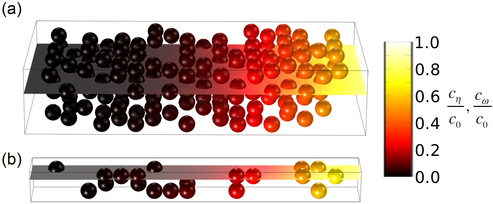
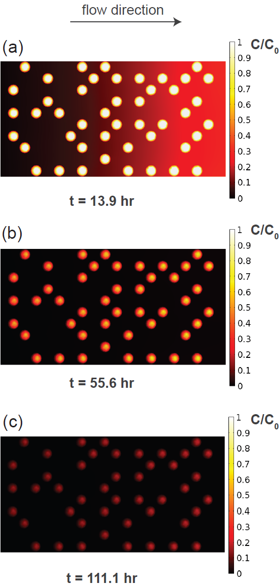
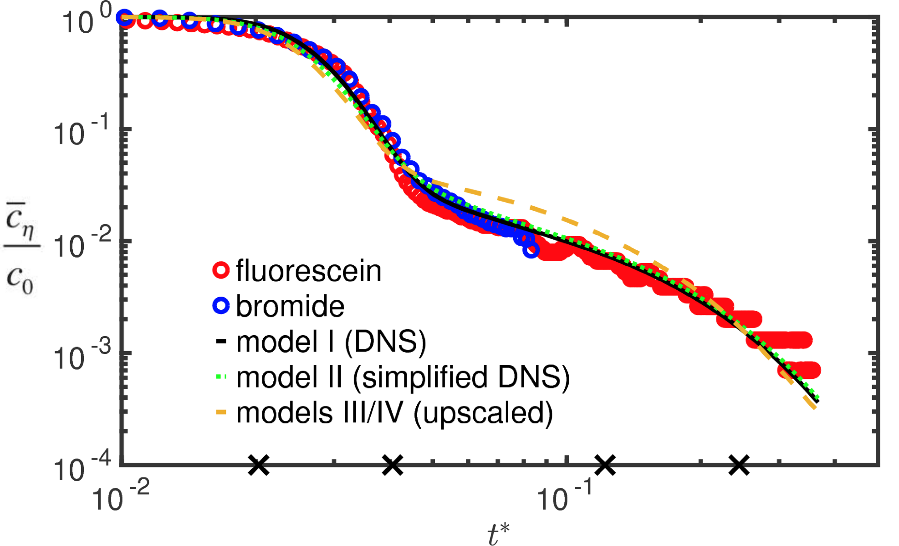

# dual porosity solute transport upscaling
Examination of a hierarchy of 4 models (in the absence of adjustable parameters) with decreasing complexity. Aim is the accurate representation of experimentally measured breakthrough curves with numerical models.  The most information-rich model was:
- (1) a direct numerical simulation of the system in which the geometry, boundary and initial conditions, and medium properties were fully independently characterized experimentally with high fidelity.  

The reduced models included; 
- (2) a simplified numerical model identical to the fully-resolved direct numerical simulation (DNS) model, but using a domain that was one-tenth the size; 
- (3) an upscaled mobile-immobile model that allowed for a time-dependent mass-transfer coefficient; and, 
- (4) an upscaled mobile-immobile model that assumed a space-time constant mass-transfer coefficient.

## Files
- results: Simulation outputs
- scripts: Plotting of experimental system and data
- simulations: mph files for simulations
- system: Inclusion geometry, experimental results

## References
- Vogler, D., Ostvar, S., Paustian, R. and Wood, B., A hierarchy of models for simulating experimental results from a 3D heterogeneous porous medium, Advances in Water Resources, 114, pp. 149-163, 2018. [https://doi.org/10.1016/j.advwatres.2018.02.009](https://doi.org/10.1016/j.advwatres.2018.02.009)

## Figures

Fig 1: Concentration in full and reduced system.  

Fig 2: Concentration evolution in full system.  

Fig 3: Final breakthrough curves.
